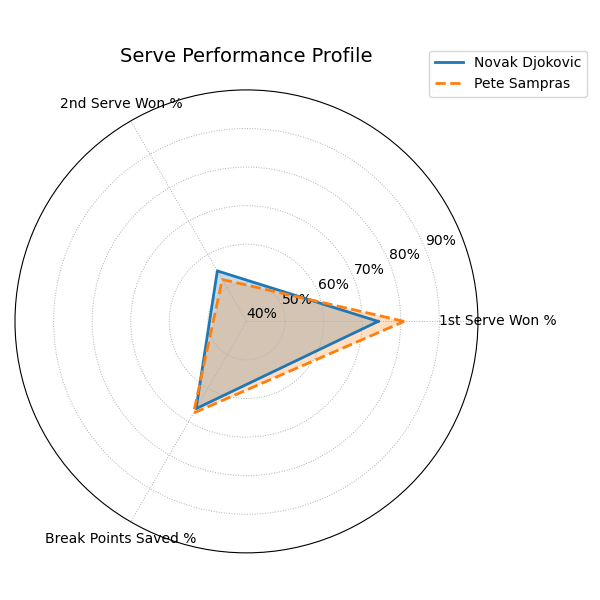
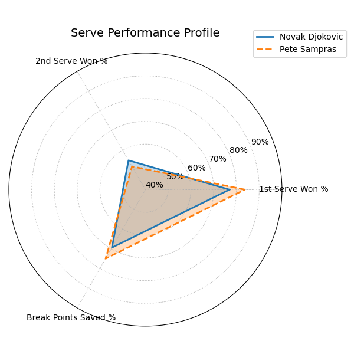
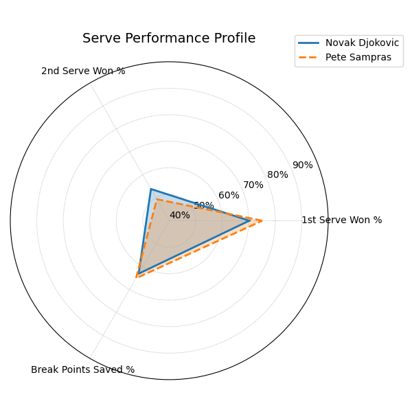

# Tennis Match Winner Prediction

## Project Goal

The primary motivation behind this project was to answer a simple but interesting question:
Who would win if Novak Djokovic and Pete Sampras played each other in their prime, and how would the
result change across different surfaces?

Since this match never happened in reality, the only way to approach the question objectively is to analyze
historical ATP data, engineer meaningful performace features and train a predictive ML model capable of estimating win probabilites
between two players.

## Project Overview

<ul>
    <li>Data cleaning and EDA</li>
    <li>Feature engineering</li>
    <li>Model selection and evaluation</li>
    <li>Development of a scalable prediction function</li>
    <li>Gradio UI</li>
</ul>

The final model is trained on ATP matches from 1991 to 2024 using Jeff Sackmann's tennis datasets.
The user can select any two players and a surface, and the system will return win probabilities along with explainable
statistics and serve performance comparison plot.

## Data Sources

The primary dataset used is <b><a href="https://github.com/JeffSackmann/tennis_atp">Jeff Sackmann's ATP match data</a></b>.

Files used: <b>atp_matches_YYYY.csv (1991 to 2024)</b>

This dataset contains detailed point-level match statistics including:
<ul>
    <li>First serve points in</li>
    <li>First serve points won</li>
    <li>Second serve points won</li>
    <li>Break points saved</li>
    <li>Service games played</li>
    <li>Match duration</li>
    <li>Player rankings and ages</li>
    <li>Surface and tournament level</li>
</ul>

These variables form the foundation of all performance-related features used in the model.

## Data Cleaning and EDA

The raw ATP data contains missing values, inconsistent formats, and incomplete statistics especially for older matches.
In the notebook <i>01_eda.ipynb</i> exploration and cleaning were done including: 

<ul>
    <li>Removal of columns with extreme missingness</li>
    <li>Filtering out outdated surfaces</li>
    <li>Converting wide match format (winner and loser per row) into a balanced framework where each row represents a single player with a binary label indicating win or loss</li>
    <li>Inspecting summary statistics to understand which metrics differentiate winners from losers</li>
</ul>

## Feature Engineering

Performance features were transformed into stable, comparable metrics across players.

<ul>
    <li>First serve percentage</li>
    <li>First serve points won percentage</li>
    <li>Second serve points won percentage</li>
    <li>Break points save percentage</li>
    <li>Ranking difference between players</li>
    <li>Age difference</li>
    <li>Player handedness difference</li>
    <li>Surface indicators</li>
    <li>Tournament level indicators</li>
</ul>

## Model Selection

### Logistic Regression

I chose LR because it is simple. interpretable and provides probabilistic outputs. It serves a baseline to verify that the engineered features contain signal and the model behaves reasonably.

LR Confusion matrix: 
<table>
<tr>
<td>15453</td>
<td>1191</td>
</tr>
<tr>
<td>1248</td>
<td>15396</td>
</tr>
</table>

### Random Forest

RF handles non-linear releationships, is robust to outliers and does not require feature scaling. It also performs well on tabular sports data and can capture interactions between serve stats, rankings, surface type and pressure-related variables such as break points faced.

RF Confusion matrix: 
<table>
<tr>
<td>15542</td>
<td>1102</td>
</tr>
<tr>
<td>1236</td>
<td>15408</td>
</tr>
</table>

## Model Limitations

Although performance is high, there are important limitations:
<ol>
<li>Model is strongly influenced by serve stats because return stats are not available in the dataset in the same detail.</li>
<li>Historical context is missing. A player recovering from injury may show depressed performance for a period affecting predictions</li>
<li>Some players have serve-heavy profiles that can appear disproportionately strong because their return performance is not modeled</li>
<li>Model predicts based on career performance on a given surface, not on a hypothetical prime-only version of players
<li>Tactical, mental or stylistic matchups that matter in real life are not available in the data, and cannot be modeled </li>
</ol>

We must keep this limitations in mind when interpreting Djokovic vs Sampras result.

## Final Results: Djokovic vs Sampras

### 🔵 Hard

Novak Djokovic win probability: <b>0.337</b>  
Pete Sampras win probability: <b>0.663</b>

    

### 🟢 Grass

Novak Djokovic win probability: <b>0.337</b>  
Pete Sampras win probability: <b>0.663</b>

    

### 🔴 Clay

Novak Djokovic win probability: <b>0.527</b>  
Pete Sampras win probability: <b>0.473</b>

    

Although the results appear resonable, they should not be interpreted as definitive predictions. Reasons are mentioned above in <i>Model Limitation</i> section.
Also, phyisical evolution of tennis makes cross-era comparison inherently difficult. In future version, I will explore what results would be using neural network models, include h2h stats and build prime-year filters.

## Gradio UI

Project includes an interactive Gradio UI that allows users to select players, select surface, view predicted win probabilities, see a serve-performance comparison plot and read statistical breakdown for each player.

